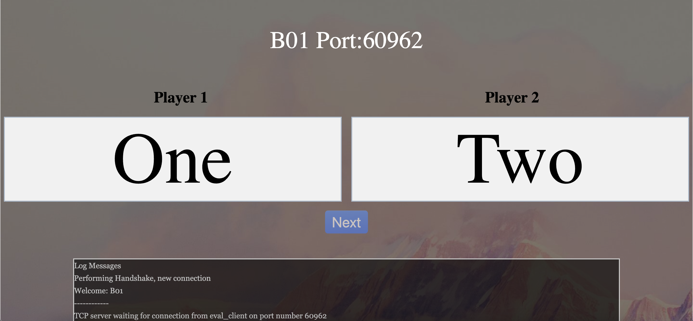

# README

This repository contains the code for the Evaluation Server for the Capstone
Project of Computer Engineering Students, CG4002. As I am the external
communications person, I have to deal with this server.

## Disclaimer

1. This repository can be public because it is just the code as to how the
   groups will be evaluated. Even if you copy the code, there is nothing
   you can do about it since the server code might change every batch.

2. The actual server repository will be private until the course is over so
   that I do not have to deal with plagiarism.

3. I can put the remarks for the methods here. Feel free to have a look at it
   but if you are taking this iteration with me and anything goes wrong, do
   not blame me.

## Directory Structure

1. `/html` contains the webpages to interface with the evaluation server.
2. `/server` contains the main code for the evaluation server.

## Pre-Requisites

In case your professors are not very helpful and forgot to include the list of
dependencies to run the python file, you may follow the following commands to
install the dependencies globally. For some unknown reason, the pycryptodome
and aiofiles are unable to be installed via virtual environment so bopzzz.

```bash
cd server
pip3 install -r requirements.txt
```

## Start Up

1. Run the evaluation server.

2. Open the web interface i.e. index.html. Submit the required information as such:

```text
Eval Server IP Addr: 127.0.0.1
Group name: B04
Password (16 char):
2 player mode: True
```

On succss, you will see the following:



3. Connect the evaluation client to the evaluation server from Ultra96 via
   TCP/IP. The TCP port on which to connect, will be displayed on the webpage.
